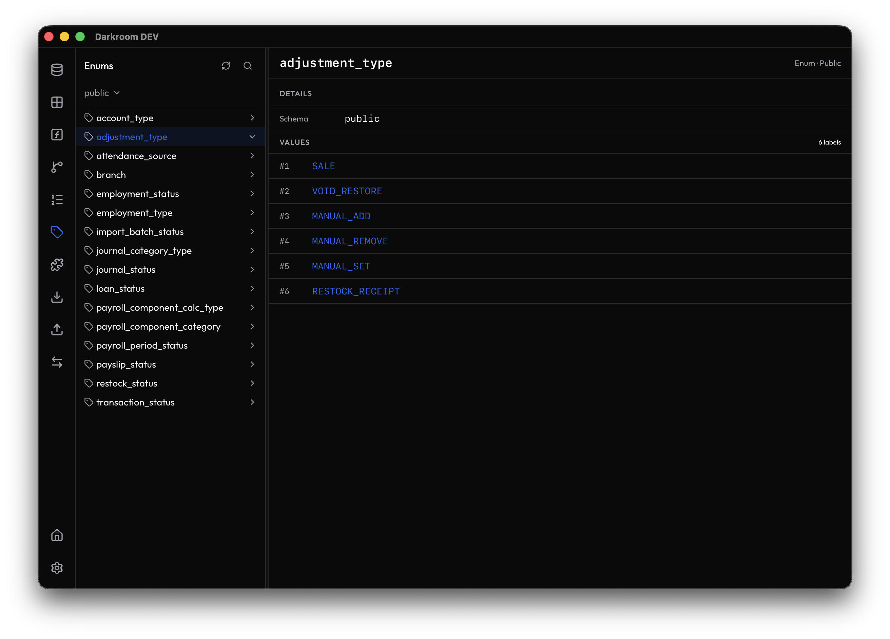

# Gridline

A modern, open-source, high-performance database GUI client for PostgreSQL and beyond. Built with Tauri 2.0, Rust, and React — lightweight by design, powerful by default.

> **Inspired by DB Pro and Beekeeper Studio's best ideas. Freed from their paywalls.** No caps on tabs, connections, or saved queries. Deep PostgreSQL tooling (`pg_dump`, `pg_restore`, DB-to-DB sync) that commercial alternatives lock behind paywalls or leave to the CLI.

---

## Why Gridline?

Most database GUI clients either lock essential productivity features behind paywalls or treat PostgreSQL administration as an afterthought. Gridline is different:

| Capability | DB Pro (Free) | Beekeeper (Free) | Gridline |
| :--- | :---: | :---: | :---: |
| Open tabs | 3 | Unlimited | **Unlimited** |
| Saved connections | 2 | Unlimited | **Unlimited** |
| Saved queries | 5 | Unlimited | **Unlimited** |
| Data export (CSV, JSON, SQL) | ❌ (paid only) | Basic only | **JSON, CSV, SQL, Markdown** |
| Data import (CSV, JSON) | ❌ (paid only) | ✅ | 🟡 *Upcoming* |
| pg_dump / pg_restore GUI | ❌ | ❌ (paid only) | **First-class UI** |
| DB-to-DB sync | ❌ | ❌ | **Built-in pipe sync** |
| Object explorer depth | Tables, views | Tables, views | **Functions, Triggers, Enums, Sequences, Extensions** |
| ER diagram / schema visualizer | ❌ (planned) | ❌ (paid only) | **✅ Interactive React Flow** |
| Inline cell editing | ✅ | ✅ | 🟡 *Upcoming* |
| SSH tunneling | 🟡 (likely paid) | ✅ | 🟡 *Config UI done* |
| OS credential vault | ✅ | ✅ | **Keychain / Secret Service** |
| Workspace / folder hierarchy | ❌ | ❌ | **Multi-level tree + tags** |
| Changes queue (stage & commit) | ❌ | ❌ | **✅ Queue → Commit All** (tab-bar **Changes** button with count badge toggles the commit panel) |
| Query history | ✅ (auto-saved) | ✅ | 🟡 *Backend done, UI pending* |
| AI assistant | ✅ (BYO key) | ❌ (paid only) | 🔮 *Planned — BYOK* |
| Open source | ❌ | ✅ (GPLv3) | **✅ (MIT)** |
| Desktop shell | Native webview | Electron (~250MB) | **Tauri 2.0 (~40MB)** |

> 🟡 = In progress or planned. **Bold** = Gridline's strongest differentiators.

---

## Screenshots

<div align="center">

<table>
  <tr>
    <td align="center" width="50%">
      <a href="./screenshots/home.png">
        
      </a>
      <br />
      <sub><b>Home Screen</b> — organized folders, tags, and quick search</sub>
    </td>
    <td align="center" width="50%">
      <a href="./screenshots/data-grid.png">
        
      </a>
      <br />
      <sub><b>Data Grid</b> — virtualized rows, column controls, and FK preview</sub>
    </td>
  </tr>
  <tr>
    <td align="center" width="50%">
      <a href="./screenshots/er-diagram.png">
        
      </a>
      <br />
      <sub><b>Schema Visualizer</b> — interactive ER diagram with cardinality legend</sub>
    </td>
    <td align="center" width="50%">
      <a href="./screenshots/enums.png">
        
      </a>
      <br />
      <sub><b>Object Explorer</b> — deep PostgreSQL objects like enums, functions, and triggers</sub>
    </td>
  </tr>
</table>

</div>

---

## Features

### Connection & Workspace Management
- **URI Parser** — paste `postgres://`, `mysql://`, `sqlite://`, or `redis://` connection strings and have all fields auto-populated
- **Workspace Tree** — multi-level hierarchy: `Workspace → Folder → Connection`, with color-coded tags (red = Production, green = Local)
- **Credential Security** — passwords stored in the OS keychain (macOS Keychain / Linux Secret Service / Windows Credential Manager), never as plaintext
- **Production Safeguards** — read-only locks and high-visibility warnings on connections tagged `Production`

### PostgreSQL Object Explorer
Full tree-view navigation of all native PostgreSQL schema objects:
- **Tables & Views** — columns, types, defaults, nullability, primary/foreign keys with popover preview
- **Functions & Procedures** — source code with syntax highlighting and line numbers, argument signatures, return types, overload support
- **Triggers & Rules** — event bindings with inline definition inspection, color-coded enabled/disabled status
- **Sequences & Enums** — current values, increments, cycle flags; enum labels in bordered list view
- **Extensions** — installed extensions with version, schema, and comment
- **Schema Visualizer (ER Diagram)** — interactive React Flow graph with dagre auto-layout, crow's foot notation (1:1, 1:N, N:M), color-coded relationships, schema selector, zoom controls, collapsible columns (PK/FK/unique-only), cross-schema FK support for PostgreSQL + SQLite
- **Unified Objects View** — Functions, Triggers, Sequences, Enums, and Extensions share a single sidebar with an object-type dropdown switcher (title position), refresh/search, and db/schema selectors

### SQL Editor & Query Workbench
- **Monaco SQL Editor** — lazy-loaded [Monaco Editor](https://microsoft.github.io/monaco-editor/) with SQL syntax highlighting, Cmd/Ctrl+Enter to run
- **Custom Query Execution** — run arbitrary SQL on PostgreSQL + SQLite via the Rust `execute_query` command; subquery-wrapped pagination with automatic raw fallback for CTEs/multi-statement SQL
- **Destructive Query Guard** — confirmation dialog for INSERT/UPDATE/DELETE/DROP/ALTER/TRUNCATE/CREATE/REPLACE before execution
- **Query Tabs** — dedicated query tabs alongside table tabs, results rendered in the same virtualized data grid, close with Cmd/Ctrl+W
- **SQL Autocomplete** — keyword + table suggestions from the active schema; typing `table.` suggests that table's columns (schema introspection, cached per schema)
- **Multi-Tab Workspace** — unlimited named tabs, session persistence across restarts
- **Changes Queue** — queue INSERT/UPDATE/DELETE changes; preview before committing all. The tab bar's **Changes** button (checklist icon + pending-count badge) toggles the bottom Commit All panel — the single entry point
- **Smart Default Sort** — auto-detects `updated_at`, `created_at`, `_id` columns for logical initial sorting
- **Query History** — recent queries per connection in a toolbar dropdown (load / run / favorite / clear), consecutive-identical dedup, retention pruned to 500 per connection
- **Saved Queries** — save the current query with a name + folder from the toolbar; manage them in the Queries view
- **Queries View** — two-pane workspace: an Explorer-styled sidebar with History / Saved Queries (per-connection scope, favorites filter, animated search) beside the tabbed query editor; click any row to load it into the editor

### Data Grid & Schema Browser
- **Virtualized Grid** — row-level virtualization via `@tanstack/react-virtual` handles 100k+ rows
- **Column Management** — resize with drag handles (double-click to auto-fit), show/hide per column, multi-column sort
- **Server-Side Filtering & Sorting** — filters and sorts pushed to SQL WHERE/ORDER BY
- **Export** — JSON, CSV, SQL, Markdown via toolbar
- **FK Preview** — click a foreign key cell to preview the referenced row
- **JSON/JSONB Viewer** — popover with formatted/raw tabs and copy button
- **Auto-Refresh** — configurable interval timer
- *(Inline cell editing, visual filter builder, and data import — upcoming)*

### PostgreSQL Administrative Tools
- **Visual Backup** — `pg_dump` wrapper with format selector (Plain SQL, Custom, Tar, Directory), file browser, schema filter, no-owner toggle, real-time progress bar
- **Visual Restore** — `pg_restore` wrapper with file browser, format, clean toggle, destructive confirmation checkbox
- **DB-to-DB Sync** — pipe `pg_dump` → `pg_restore` between two connections with source/target pickers, schema filter, flow indicator
- **Unified Tools View** — Backup, Restore, and DB-to-DB Sync grouped under one **Tools** view with an operation-switcher dropdown

### App Portability
- **Export** — save all workspaces, folders, saved queries, tags, and non-sensitive metadata to a single JSON archive
- **Import** — restore your exact workspace setup on any machine instantly

---

## Tech Stack

| Layer | Technology | Role |
| :--- | :--- | :--- |
| **Desktop Shell** | [Tauri 2.0](https://tauri.app) | Native desktop container (~40MB RAM baseline) |
| **Backend** | Rust + [tokio](https://tokio.rs) | Async runtime, connection pooling, CLI tool execution |
| **Database Drivers** | [sqlx](https://github.com/launchbadge/sqlx) / [tokio-postgres](https://github.com/sfackler/rust-postgres) | Pure-Rust async PostgreSQL (MySQL, SQLite to follow) |
| **CLI Integration** | `std::process::Command` | Wraps system `pg_dump` / `pg_restore` binaries |
| **Frontend** | [React 19](https://react.dev) + [TypeScript](https://www.typescriptlang.org) | Component-based UI |
| **Styling** | [Tailwind CSS](https://tailwindcss.com) | Utility-first, dark mode, glassmorphic design |
| **State** | [Zustand](https://zustand.docs.pmnd.rs) / [Jotai](https://jotai.org) | Lightweight client-state for tabs, connections, queries |
| **Code Editor** | [Monaco Editor](https://microsoft.github.io/monaco-editor/) | IDE-grade SQL editing with Cmd+Enter execution, lazy-loaded |
| **Data Grid** | [TanStack Virtual](https://tanstack.com/virtual) | Virtualized row rendering for 100k+ rows |
| **Local DB** | SQLite via [rusqlite](https://github.com/rusqlite/rusqlite) | User settings, saved queries, workspace state |

---

## Development

### Prerequisites
- [Rust](https://rustup.rs) (latest stable)
- [Bun](https://bun.sh) (or Node.js + npm)
- Tauri system dependencies ([see guide](https://tauri.app/start/prerequisites/))
- PostgreSQL client tools (`pg_dump`, `pg_restore`) for admin features

### Setup

```bash
# Clone
git clone https://github.com/adrianbonpin/gridline.git
cd gridline

# Install frontend dependencies
bun install

# Run in development mode (hot-reload)
bun run tauri dev

# Build for production
bun run tauri build
```

### Project Structure

```
gridline/
├── src/                    # React frontend
│   ├── components/         # Reusable UI components
│   ├── stores/             # Zustand/Jotai state stores
│   ├── hooks/              # Custom React hooks
│   ├── lib/                # Utilities, types, Tauri bindings
│   ├── App.tsx             # Root component
│   └── main.tsx            # Entry point
├── src-tauri/              # Rust backend
│   ├── src/
│   │   ├── main.rs         # Entry point
│   │   ├── lib.rs          # Tauri command registration
│   │   ├── db/             # Database connection & pooling
│   │   ├── commands/       # Tauri IPC command handlers
│   │   └── models/         # Data structures & serde types
│   ├── Cargo.toml
│   └── tauri.conf.json
├── public/                 # Static assets
├── package.json
├── tsconfig.json
└── vite.config.ts
```

### Architecture

```
┌──────────────────────────────────────────────────┐
│                    Tauri Shell                     │
│  ┌─────────────────┐   ┌────────────────────────┐ │
│  │   React (WebView)│   │     Rust Backend       │ │
│  │                  │   │                        │ │
│  │  • Monaco Editor │◄──►│ • sqlx/tokio-postgres  │ │
│  │  • Glide Grid    │IPC│ • Connection pool      │ │
│  │  • Tailwind UI   │   │ • pg_dump/restore      │ │
│  │  • Zustand state │   │ • SQLite (local)       │ │
│  │                  │   │ • OS Keychain          │ │
│  └─────────────────┘   └────────────────────────┘ │
└──────────────────────────────────────────────────┘
                          │
                          ▼
              ┌─────────────────────┐
              │  PostgreSQL / MySQL  │
              │  SQLite / Redis      │
              └─────────────────────┘
```

---

## Roadmap

### ✅ Completed
- **Phase 1 — Core Shell** — Tauri 2.0 + React project, glassmorphic dark-first UI, Zustand state management, SQLite local persistence, OS keychain credentials
- **Phase 2 — Connection Management** — Rust connection pool (`sqlx`/`tokio-postgres`), PostgreSQL + SQLite browse/query, URI parser with auto-population, SSH/SSL config UI, connection testing for all DB types
- **Phase 3 — Schema Explorer** — Full PostgreSQL `pg_catalog`/`information_schema` introspection, object tree (Tables, Views, Functions, Triggers, Enums, Sequences, Extensions), per-type detail views, FK preview popover, JSON/JSONB viewer
- **Phase 4 — Data Grid & Filters** — Virtualized grid (`@tanstack/react-virtual`, 100k+ rows), server-side sorting/filtering, column show/hide, column resize, export (JSON/CSV/SQL/Markdown), auto-refresh, pagination
- **Phase 5 — Admin Tools** — `pg_dump`/`pg_restore` UI wrappers with real-time progress, DB-to-DB sync, backup/restore format selectors
- **Phase 6 — Schema Visualizer** — Interactive ER diagram with React Flow + dagre, crow's foot notation, schema selector, legend, collapsible column views, PostgreSQL + SQLite support
- **Home Screen & Organization** — Connection cards by folder, folders CRUD, tags CRUD with colors, global search (Cmd+K), import/export connections (JSON), bulk select/delete, DB type filter, demo SQLite database
- **Query Editor (Core)** — Monaco SQL editor with Cmd+Enter execution, `execute_query` Rust command (PostgreSQL + SQLite, subquery pagination with raw fallback), query tabs in the DB viewer, destructive query confirmation dialog, `query_history` persistence backend
- **Home Screen Filters** — Tag filter with OR semantics, folder cards matching tags or containing matching connections, DB type filter hiding empty folders, environment filter (All/Production/Staging/Development/None), global search across all folders with "Showing Search Results" breadcrumb + Clear
- **Query History & Saved Queries** — toolbar history dropdown (load / run / favorite / clear), favorites, consecutive-identical dedup + 500-retention pruning, SaveQueryDialog, and a two-pane Queries view (History / Saved Queries sidebar scoped per connection + tabbed query workspace)
- **Consolidated Navigation** — merged Functions/Triggers/Sequences/Enums/Extensions into a single Objects view (object-type dropdown) and Backup/Restore/DB Sync into a single Tools view (operation dropdown)

### 🟡 In Progress / Upcoming
- **Editor Settings** — font, tab size, word wrap, minimap options
- **SSH/SSL Runtime** — SSH tunnel via `ssh2` crate, SSL/TLS config passed to `sqlx`/`tokio-postgres`
- **Inline Cell Editing** — Edit cells directly in the data grid
- **Data Import** — CSV, JSON import with column mapping

### 🔮 Future
- **Multi-DB Support** — MySQL browsing, Redis key browser, full MySQL/SQLite/Redis parity with PostgreSQL
- **Query Workbench** — Multiple result sets, visual query builder
- **Deeper PostgreSQL** — Indexes, constraints, materialized views, stored procedure view, user/role management
- **Notebook Reports** — SQL-backed markdown reports with embedded results
- **AI Integration (BYOK)** — Bring-Your-Own-Key AI assistant: natural-language → SQL generation, query explanations, schema summaries, error suggestions. Key stored in OS keychain; only user's chosen provider sees SQL/text.

---

## License

MIT — see [LICENSE](./LICENSE) for details.

---

<p align="center">
  <sub>Built with ♥ for developers who believe powerful tools should be free.</sub>
</p>