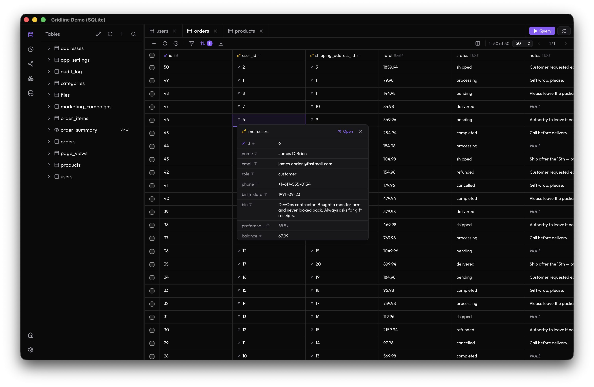
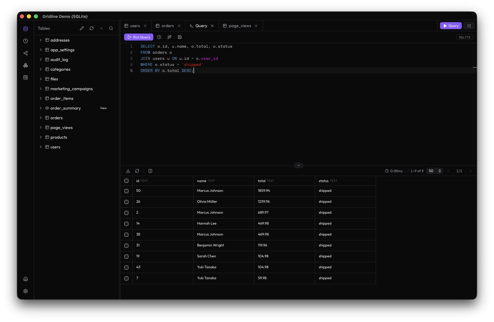
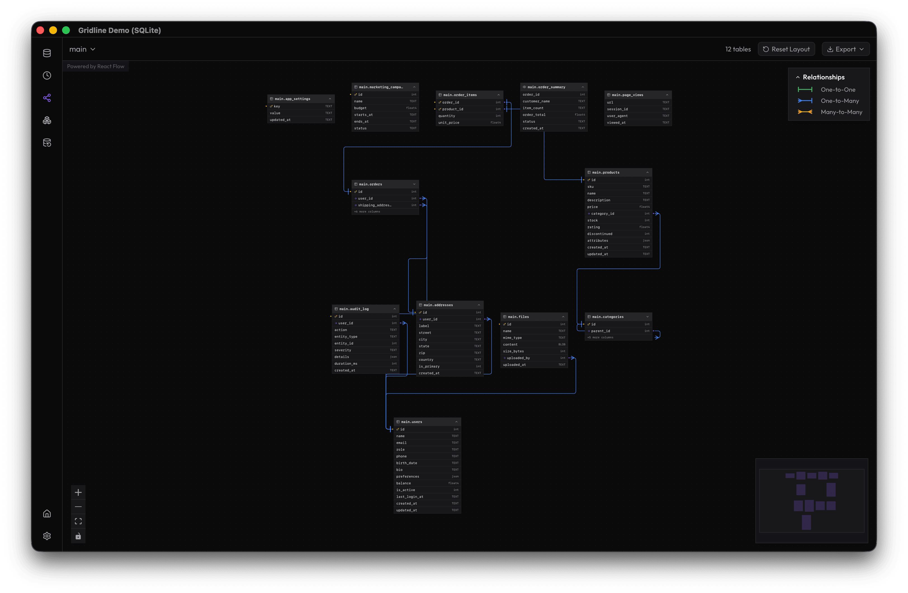
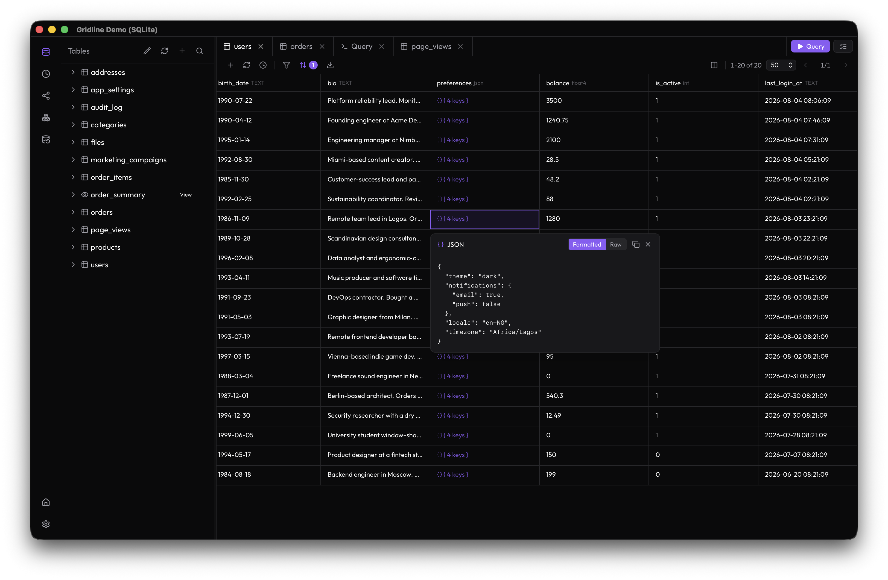
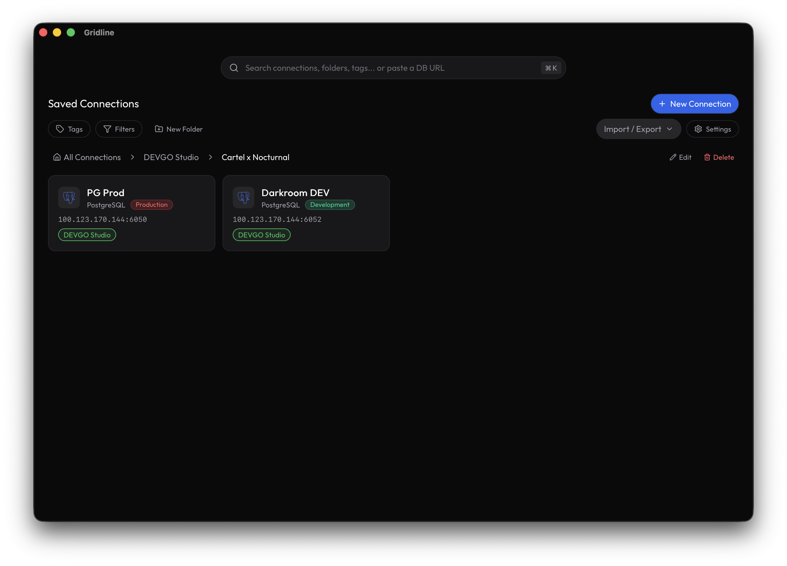

<p align="center">
  
</p>

<h1>Gridline</h1>

<p>
  <i>A lightweight, open-source database GUI for PostgreSQL, MySQL, SQLite, and Redis.</i><br />
  Unlimited connections, tabs, and saved queries — with first-class <code>pg_dump</code>, <code>pg_restore</code>, and DB-to-DB sync.
</p>

<p>
  <sub><b>Data Grid & FK Preview</b> — browse 50+ real demo orders and inspect related rows in one click.</sub>
</p>

<p>
  <a href="https://tauri.app/"></a>
  <a href="https://www.rust-lang.org/"></a>
  <a href="https://react.dev/"></a>
  <a href="https://www.typescriptlang.org/"></a>
  <a href="./LICENSE"></a>
  <a href="https://github.com/adrianbonpin/gridline/stargazers"></a>
</p>

<p>
  <a href="https://github.com/adrianbonpin/gridline/releases"></a>
  <a href="https://github.com/adrianbonpin/gridline/issues/new"></a>
</p>

---

## Download

Grab the installer for your OS from the [latest release](https://github.com/AdrianBonpin/gridline/releases/latest) — the links below point at the current release (**v0.7.6**):

| OS | Architecture | Download |
| :--- | :--- | :--- |
| **macOS** | Apple Silicon (M1/M2/M3/M4…) | [Gridline_0.7.6_aarch64.dmg](https://github.com/AdrianBonpin/gridline/releases/download/v0.7.6/Gridline_0.7.6_aarch64.dmg) |
| **macOS** | Intel | [Gridline_0.7.6_x64.dmg](https://github.com/AdrianBonpin/gridline/releases/download/v0.7.6/Gridline_0.7.6_x64.dmg) |
| **Windows** | x64 | [Gridline_0.7.6_x64-setup.exe](https://github.com/AdrianBonpin/gridline/releases/download/v0.7.6/Gridline_0.7.6_x64-setup.exe) |
| **Debian / Ubuntu** | amd64 | [Gridline_0.7.6_amd64.deb](https://github.com/AdrianBonpin/gridline/releases/download/v0.7.6/Gridline_0.7.6_amd64.deb) |
| **Fedora / RHEL / openSUSE** | x86_64 | [Gridline-0.7.6-1.x86_64.rpm](https://github.com/AdrianBonpin/gridline/releases/download/v0.7.6/Gridline-0.7.6-1.x86_64.rpm) |
| **Other Linux** | amd64 | [Gridline_0.7.6_amd64.AppImage](https://github.com/AdrianBonpin/gridline/releases/download/v0.7.6/Gridline_0.7.6_amd64.AppImage) |

> Not sure if your Mac is Intel or Apple Silicon? See [Which file should I download?](#which-file-should-i-download) below. All installers are **unsigned** — see the [notes](#which-file-should-i-download) on first-launch warnings.

<!--
  MAINTENANCE: These links are STATIC (versioned) — they point at the v0.7.6
  release assets, not at a moving "latest" target. On every new release,
  update BOTH tables here (Download + Which file should I download?) to the
  new version's asset names, which are tauri-action's default naming:
    Gridline_<version>_aarch64.dmg / _x64.dmg / _x64-setup.exe /
    _amd64.deb / _amd64.AppImage  and  Gridline-<version>-1.x86_64.rpm
  The .msi (Gridline_<version>_x64_en-US.msi) is not linked below.
-->

---

## What is Gridline?

Gridline is a modern, open-source database GUI client built with [Tauri 2.0](https://tauri.app), Rust, and React. It is lightweight by design (~40 MB baseline), powerful by default, and free from the paywalls that limit commercial alternatives.

- **No caps** on connections, tabs, or saved queries.
- **Deep PostgreSQL tooling** — visual `pg_dump`, `pg_restore`, and DB-to-DB sync.
- **Full MySQL + SQLite browsing** — connect, browse, query, and edit MySQL and SQLite the same way you do PostgreSQL.
- **Full object explorer** — not just tables, but functions, triggers, sequences, enums, extensions, materialized views, and procedures.
- **Interactive ER diagram** — explore relationships visually with crow's-foot cardinality notation.
- **Production-safe editing** — stage INSERT/UPDATE/DELETE changes, review the generated SQL, then commit all at once.

The app ships with a built-in **Gridline Demo (SQLite)** database, so you can explore every feature immediately without setting up a server.

---

## Who is it for?

Gridline is built for developers and small teams who manage multiple database environments:

- **Full-stack developers** switching between local, staging, and production databases.
- **Platform / DBAs** who need `pg_dump`, `pg_restore`, and sync tooling in a native UI.
- **Teams that want native speed** without Electron bloat or seat licenses.

---

## Recent Changes

- **v0.7.6** — Full PostgreSQL object management (create/edit/drop for enums, functions, procedures, triggers, sequences, extensions, views, materialized views, indexes, constraints) staged through the changes queue with generated-SQL previews; Enable Keychain toggle wired (default ON, opt-out; OFF = session-only); Objects view upgraded to the shared tabbed workspace (object detail tabs with per-type icons, inline manual query + changes queue); ⌘K object search fixes; version bump.

- **2026-08-05:** v0.7.5 — bundled `pg_dump`/`pg_restore`/`psql` (system-first, bundled fallback) so admin features work with no separate install; schema CRUD (create/rename/drop with CASCADE + dependency warning); Cmd+K object search (current schema, all object types); copy-as-DDL for every browsable object type; `pg_depend` object-dependency view shown before destructive drops.
- **2026-08-04:** v0.7.5 — revamped the New Connection screen into a two-stage flow with a 6-provider grid (PostgreSQL, MySQL, SQLite, Redis, Supabase, NeonDB; managed presets ship with setup guides + SSL hints) and added full MySQL DB viewer support (connect, browse, query, inline cell editing + changes queue, DDL copy).
- **2026-08-04:** Revamped the built-in SQLite demo database with realistic e-commerce data (20 users, 24 products, 50 orders, 100 page views, 500 audit rows) and renamed it to **Gridline Demo (SQLite)**.
- **2026-07-XX:** Added inline cell editing with a stage-first changes queue, row-detail drawer, keyboard navigation, and cell-level copy.
- **2026-07-XX:** Added visual filter builder with drag-and-drop column palette and type-aware operators.
- **2026-07-XX:** Added schema visualizer with React Flow + dagre, crow's-foot notation, and cross-schema FK support.
- **2026-07-XX:** Added query history dropdown, saved queries, and a two-pane Queries view.
- **2026-06-XX:** Added settings redesign with live theme, accent color, font size, editor options, and tag reorder.
- **2026-06-XX:** Added SSH tunneling (password + key auth) and full PostgreSQL TLS runtime for production connections.

> See the full history in the [roadmap](#roadmap) below or the [git log](./commits).

---

## Key Features

### Connections & Workspace

- **URI auto-fill** — paste `postgres://`, `mysql://`, `sqlite://`, or `redis://` strings and have all fields populate automatically.
- **Provider grid** — pick PostgreSQL, MySQL, SQLite, Redis, Supabase, or NeonDB; managed presets surface in-app setup guides and an SSL hint.
- **Workspace tree** — multi-level folders, color-coded tags, favorites, and recent connections.
- **OS keychain storage** — passwords and SSH secrets live in macOS Keychain / Linux Secret Service / Windows Credential Manager, never in plaintext.
- **SSH tunneling** — real `ssh2` tunnels with password or key authentication.
- **TLS / SSL** — full PostgreSQL/MySQL TLS modes plus client-certificate support.
- **Connection status** — on-demand per-card test with real server version and latency.

### Schema Explorer

- **Tables, views, and materialized views** — column metadata, PK/FK, defaults, nullable flags.
- **Functions & procedures** — syntax-highlighted source, argument signatures, overload disambiguation.
- **Triggers, sequences, enums, extensions** — unified **Objects** view with type switcher.
- **Indexes & constraints** — per-table index details plus CHECK/UNIQUE constraints beyond PK/FK.
- **Schema CRUD** — create/rename/drop schemas from the object tree, with typed-name + dependency warning on CASCADE drops.
- **Global object search** — ⌘K, current schema, all object types; results open a table tab or jump to the Objects view.
- **Copy as DDL** — `CREATE` DDL for every browsable object type.
- **Object dependencies** — `pg_depend` "what depends on this?" view before destructive drops.
- **Schema visualizer** — interactive ER diagram with auto-layout, cardinality legend, and collapsible columns.

### Data Grid

- **Virtualized rows** — handles 100k+ rows via `@tanstack/react-virtual`.
- **Server-side filtering & sorting** — pushed to SQL `WHERE`/`ORDER BY`.
- **FK preview** — click the ↗ icon on a foreign-key cell to inspect the referenced row or open a filtered tab.
- **JSON/JSONB viewer** — formatted and raw tabs with copy.
- **Inline cell editing** — double-click or press Enter; changes stage through the queue before commit.
- **Smart editors** — enum dropdowns for PG enum columns, searchable FK dropdowns for related rows.
- **Visual filter builder** — drag-and-drop columns with type-aware operators.
- **Export** — JSON, CSV, SQL, and Markdown downloads of visible rows.
- **Auto-refresh** — configurable interval timer.

### Query Workbench

- **Monaco SQL editor** — lazy-loaded, with keywords + table/column autocomplete.
- **Custom query execution** — arbitrary SQL with destructive-query confirmation.
- **Query tabs** — unlimited tabs, close with `Cmd/Ctrl+W`.
- **Query history** — per-connection, with favorites and pruning.
- **Saved queries** — name, folder, and manage them in the Queries view.
- **Changes queue** — stage edits, review generated SQL, revert per change, then commit all.

### PostgreSQL Admin Tools

- **Visual Backup** — `pg_dump` wrapper with format selector, schema filter, no-owner toggle, real-time progress.
- **Visual Restore** — `pg_restore` wrapper with clean toggle and destructive confirmation.
- **DB-to-DB Sync** — pipe `pg_dump` → `pg_restore` between two connections.
- **Bundled client tools** — `pg_dump`/`pg_restore`/`psql` ship with the app; system tools are preferred when present, bundled tools are the fallback.

---

## Screenshots

<div align="center">

<table>
  <tr>
    <td align="center" width="50%">
      <a href="./screenshots/query-editor.png">
        
      </a>
      <br />
      <sub><b>Query Editor</b></sub>
    </td>
    <td align="center" width="50%">
      <a href="./screenshots/er-diagram.png">
        
      </a>
      <br />
      <sub><b>Schema Visualizer</b></sub>
    </td>
  </tr>
  <tr>
    <td align="center" width="50%">
      <a href="./screenshots/json-popover.png">
        
      </a>
      <br />
      <sub><b>JSON Viewer</b></sub>
    </td>
    <td align="center" width="50%">
      <a href="./screenshots/home.png">
        
      </a>
      <br />
      <sub><b>Home Screen</b></sub>
    </td>
  </tr>
</table>

</div>

---

## Why Gridline vs the alternatives?

Capabilities below are fact-checked against each vendor's official docs and pricing (May 2026).

| Capability                     |        DB Pro (Free)         |        Beekeeper (Free)         |      TablePlus (Free)       |                          Gridline                          |
| :----------------------------- | :--------------------------: | :-----------------------------: | :-------------------------: | :--------------------------------------------------------: |
| Open tabs                      |              3               |           Unlimited             |              2              |                      **Unlimited**                         |
| Saved connections              |              2               |           Unlimited             |          Unlimited          |                      **Unlimited**                         |
| Saved queries                  |              5               |           Unlimited             |          Unlimited          |                      **Unlimited**                         |
| Data export (CSV, JSON, SQL)   |     ✅ (unlimited = paid)     |         Basic only              |             ✅              |              **JSON, CSV, SQL, Markdown**                  |
| `pg_dump` / `pg_restore` GUI   |              ❌              |        ❌ paid only             |             ✅              |                   **First-class UI**                       |
| DB-to-DB sync                  |              ❌              |                ❌                |             ❌              |                 **Built-in pipe sync**                     |
| Object explorer depth          | Tables, views, indexes, enums | Tables, views, routines, triggers | Tables, views, functions, procedures | **Functions, Triggers, Sequences, Enums, Extensions + full detail** |
| ER diagram / schema visualizer |        ✅ view-only          |        ❌ paid only             |             ❌              |                **✅ React Flow + dagre**                   |
| SSH tunneling                  |        ❌ paid only          |                ✅                |             ✅              |        **✅ Password + key auth, keychain**                |
| OS credential vault            |              ✅              |                ✅                |             ✅              |   **Keychain / Secret Service / Credential Manager**       |
| Workspace / folder hierarchy   |  ✅ query/dash folders + tags |     ✅ (5.7+, local)             |             ❌              |              **Multi-level tree + tags**                   |
| Changes queue (stage → commit) |              ❌              |        ✅ Apply/Discard          |         ✅ Safe mode         |              **✅ Queue → Commit All**                     |
| Desktop shell size             |           Electron            |      Electron (~250 MB)         |           Native            |                 **Tauri 2.0 (~40 MB)**                     |
| Open source                    |              ❌              |          ✅ GPLv3                |             ❌              |                     **✅ Apache 2.0**                      |

*Notes: DB Pro is an Electron app (launched Nov 2025) whose marketing copy overclaims — its free plan caps connections/tabs/saved queries (FAQ inconsistently claims "unlimited local connections") and gates data imports + SSH tunneling to paid, though CSV/JSON export does work on the free tier; Beekeeper's free Community edition genuinely offers unlimited tabs/connections/queries but gates backup/restore, file import, multi-table export, ERD, AI, and premium DB connectors behind paid tiers; TablePlus's free tier includes every feature but caps you at 2 open tabs / 2 windows / 2 advanced filters.*

---

## Tech Stack

| Layer               | Technology                                                                                                | Role                                             |
| :------------------ | :-------------------------------------------------------------------------------------------------------- | :----------------------------------------------- |
| **Desktop shell**   | [Tauri 2.0](https://tauri.app)                                                                            | Native webview container (~40 MB baseline)       |
| **Backend**         | Rust + [tokio](https://tokio.rs)                                                                          | Async runtime, connection pooling, CLI execution |
| **DB drivers**      | [sqlx](https://github.com/launchbadge/sqlx) / [tokio-postgres](https://github.com/sfackler/rust-postgres) | PostgreSQL via tokio-postgres; MySQL via sqlx; SQLite via rusqlite |
| **CLI integration** | `std::process::Command`                                                                                   | Wraps bundled or system `pg_dump` / `pg_restore` |
| **Frontend**        | [React 19](https://react.dev) + [TypeScript](https://www.typescriptlang.org)                              | Component-based UI                               |
| **Styling**         | [Tailwind CSS](https://tailwindcss.com)                                                                   | Utility-first, dark mode, glassmorphic design    |
| **State**           | [Zustand](https://zustand.docs.pmnd.rs) / Jotai                                                           | Domain stores                                    |
| **Editor**          | [Monaco Editor](https://microsoft.github.io/monaco-editor/)                                               | IDE-grade SQL editing                            |
| **Data grid**       | [TanStack Virtual](https://tanstack.com/virtual)                                                          | 100k+ row virtualization                         |
| **Local store**     | SQLite via [rusqlite](https://github.com/rusqlite/rusqlite)                                               | Settings, saved queries, workspace state         |

---

## Getting Started

### Download a release

Pre-built installers for macOS, Windows, and Linux are published on the [Releases](https://github.com/adrianbonpin/gridline/releases) page.

> ⚠️ Gridline is under active development. Expect rough edges and please [open issues](https://github.com/adrianbonpin/gridline/issues/new) when you hit them.

#### Installers are unsigned (for now)

Gridline is currently distributed **unsigned** — it doesn't pay for code-signing certificates yet. Your OS will warn you the first time you open it. This is expected — the app is safe, it just hasn't paid the signing fee:

- **macOS:** right-click the app → **Open** → **Open** (or System Settings → Privacy & Security → **Open Anyway**). Do this once per version.
- **Windows:** on the SmartScreen prompt, click **More info** → **Run anyway**.
- **Linux:** no warning — install and run normally.

Code signing **will be added in the future** (Apple Developer Program + a Windows signing cert, e.g. Azure Trusted Signing) — the CI workflow is already wired to pick up the signing secrets automatically the moment they exist, no workflow changes needed.

#### Which file should I download?

Each release contains **one file per platform** — you only need the one that matches your computer. The links below point at the current release (**v0.7.6**):

| Your system | Download this | Notes |
| :--- | :--- | :--- |
| macOS **Apple Silicon** (M1/M2/M3/M4…) | [Gridline_0.7.6_aarch64.dmg](https://github.com/AdrianBonpin/gridline/releases/download/v0.7.6/Gridline_0.7.6_aarch64.dmg) | `aarch64` = Apple's own chip |
| macOS **Intel** | [Gridline_0.7.6_x64.dmg](https://github.com/AdrianBonpin/gridline/releases/download/v0.7.6/Gridline_0.7.6_x64.dmg) | `x64` = Intel/AMD |
| **Windows** (most PCs) | [Gridline_0.7.6_x64-setup.exe](https://github.com/AdrianBonpin/gridline/releases/download/v0.7.6/Gridline_0.7.6_x64-setup.exe) | The `.msi` is an alternate installer (for enterprises/IT admins) |
| **Debian / Ubuntu** | [Gridline_0.7.6_amd64.deb](https://github.com/AdrianBonpin/gridline/releases/download/v0.7.6/Gridline_0.7.6_amd64.deb) | Install: `sudo apt install ./Gridline_0.7.6_amd64.deb` |
| **Fedora / RHEL / openSUSE** | [Gridline-0.7.6-1.x86_64.rpm](https://github.com/AdrianBonpin/gridline/releases/download/v0.7.6/Gridline-0.7.6-1.x86_64.rpm) | Install: `sudo dnf install Gridline-0.7.6-1.x86_64.rpm` |
| **Any other Linux** | [Gridline_0.7.6_amd64.AppImage](https://github.com/AdrianBonpin/gridline/releases/download/v0.7.6/Gridline_0.7.6_amd64.AppImage) | Works on every distro: `chmod +x` the file, then double-click it |

**Not sure if your Mac is Intel or Apple Silicon?** Click the **Apple menu** → **About This Mac**. If it shows "Apple M1/M2/M3/M4…" download the `aarch64` file; if it shows an Intel chip, download `x64`. Downloading the wrong one won't run.

#### How releases are made

Cutting a release is one command — CI builds everything. **Releases are cut from `prod`, which is the production branch** — only push release tags from `prod`, never from feature branches:

```bash
git checkout prod && git pull
git tag v0.7.6
git push origin v0.7.6
```

GitHub Actions (`.github/workflows/release.yml`) builds installers for **Apple Silicon, Intel Macs, Windows, and Linux**, then opens a **draft release** on the [Releases](https://github.com/adrianbonpin/gridline/releases) page — review it and hit **Publish release**.

Before tagging, make sure the version number is in sync across `package.json`, `src-tauri/Cargo.toml`, and `src-tauri/tauri.conf.json`, and update the **README download tables** (Download + Which file should I download?) to the new version's asset names.

### Build from source

```bash
# 1. Clone the repository
git clone https://github.com/adrianbonpin/gridline.git
cd gridline

# 2. Install frontend dependencies
bun install

# 3. Run in development mode with hot-reload
bun run tauri dev

# 4. Build for production
bun run tauri build
```

### System requirements

- **macOS:** 13 (Ventura) or newer
- **Windows:** 10 or newer
- **Linux:** Ubuntu 22.04+ or equivalent modern distribution
- **RAM:** 8 GB recommended
- **PostgreSQL client tools:** `pg_dump`/`pg_restore`/`psql` are **bundled** with Gridline — no separate install required for backup/restore/sync. (System tools, if installed, are preferred.)

---

## Development

```bash
# Frontend only (Vite dev server)
bun run dev

# Full Tauri app with hot-reload
bun run tauri dev

# Production build
bun run tauri build

# Rust backend only
cd src-tauri
cargo build

# Run tests
cargo test
```

### Project structure

```
gridline/
├── src/                    # React frontend
│   ├── components/         # Reusable UI components
│   ├── stores/             # Zustand/Jotai state stores
│   ├── hooks/              # Custom React hooks
│   ├── lib/                # Utilities, types, Tauri bindings
│   ├── App.tsx             # Root component
│   └── main.tsx            # Entry point
├── src-tauri/              # Rust backend
│   ├── src/
│   │   ├── main.rs         # Entry point
│   │   ├── lib.rs          # Tauri command registration
│   │   ├── db/             # Database connection & pooling
│   │   ├── commands/       # Tauri IPC command handlers
│   │   └── models/         # Data structures & serde types
│   ├── Cargo.toml
│   └── tauri.conf.json
├── public/                 # Static assets
├── package.json
├── tsconfig.json
└── vite.config.ts
```

---

## Roadmap

The full plan — in-development (v0.7.6), next-up, queue, and shipped history — lives in **[ROADMAP.md](./ROADMAP.md)**.

Highlights of what's next:

- **Admin follow-up** — PostgreSQL users/roles + grants management, and table maintenance actions (VACUUM / ANALYZE / REINDEX)
- **Full Redis support** — key browser, type-aware value editors, TTL management
- **More database types** — MariaDB, TimescaleDB, and friends
- **Managed DB support** — PlanetScale, Turso (Supabase/Neon presets shipped in v0.7.0)
- **AI integration (BYOK)** — natural-language → SQL, chat, summaries, charts

✅ **[View the full roadmap →](./ROADMAP.md)**

---

## Table of Contents

- [Download](#download)
- [What is Gridline?](#what-is-gridline)
- [Who is it for?](#who-is-it-for)
- [Recent Changes](#recent-changes)
- [Key Features](#key-features)
- [Screenshots](#screenshots)
- [Why Gridline vs the alternatives?](#why-gridline-vs-the-alternatives)
- [Tech Stack](#tech-stack)
- [Getting Started](#getting-started)
- [Development](#development)
- [Roadmap](#roadmap)
- [Contributing](#contributing)
- [License](#license)

---

## Contributing

Contributions, bug reports, and feature ideas are welcome. Gridline is Apache 2.0-licensed and intentionally stays open — no paywalled tiers, no bundled proprietary services.

- Report a bug via the **[issue template](.github/ISSUE_TEMPLATE/bug_report.md)** — it walks you through environment details (OS, Gridline version, DB type/version, connection method) so we can reproduce issues quickly. Opening a [new issue](https://github.com/AdrianBonpin/gridline/issues/new) pre-fills the template automatically.
- Submit a pull request. Keep Tauri commands thin, type IPC boundaries explicitly, and follow the existing Rust/React conventions.

---

## License

Apache 2.0 — see [LICENSE](./LICENSE) for details.
